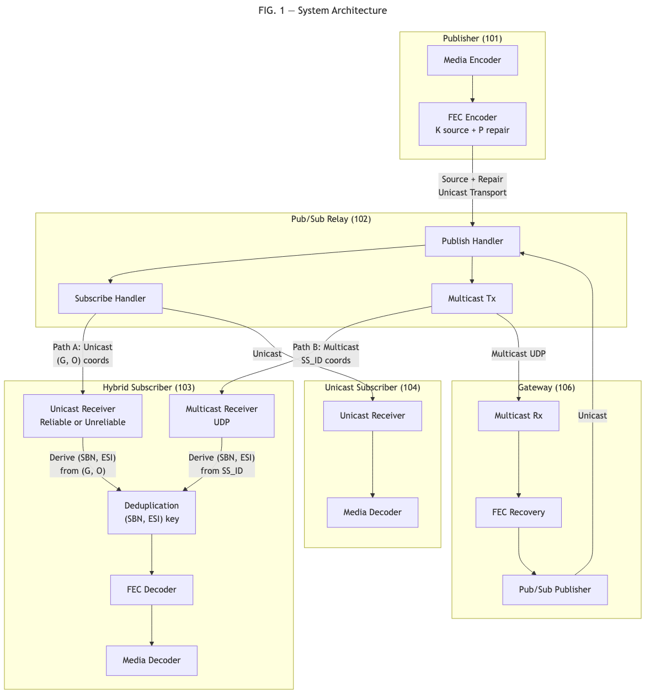
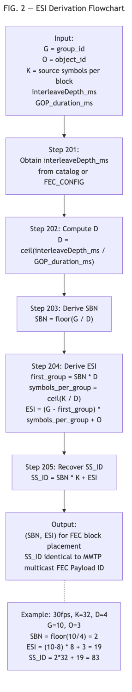
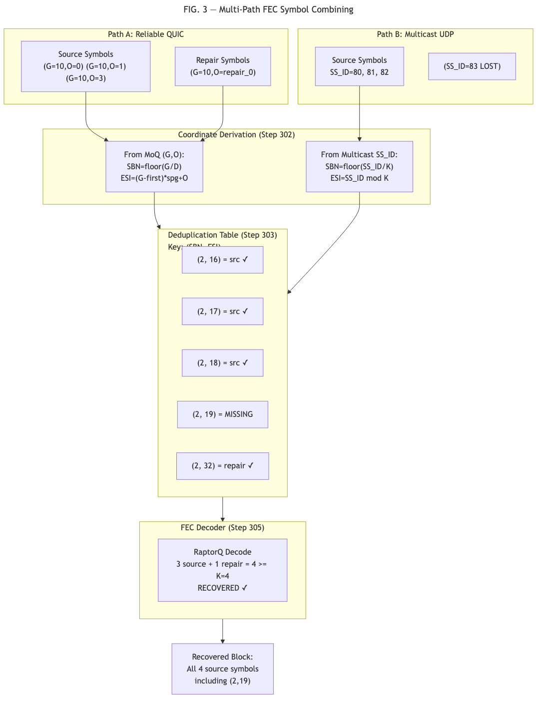
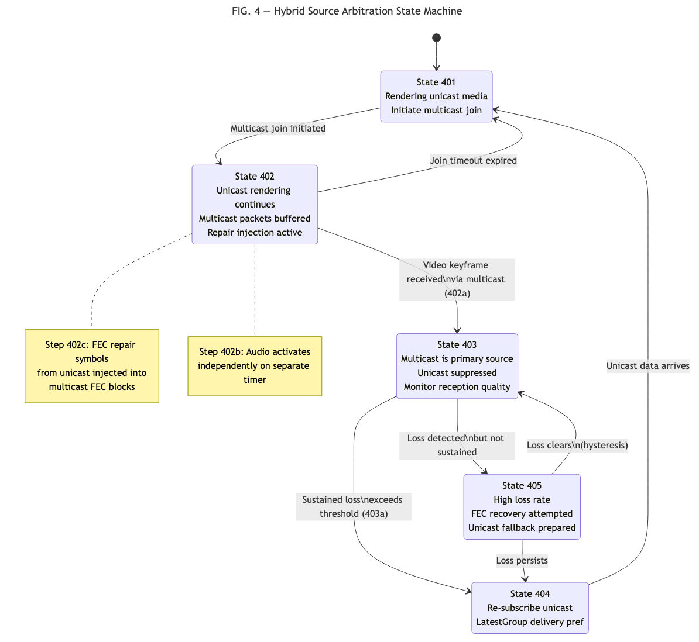
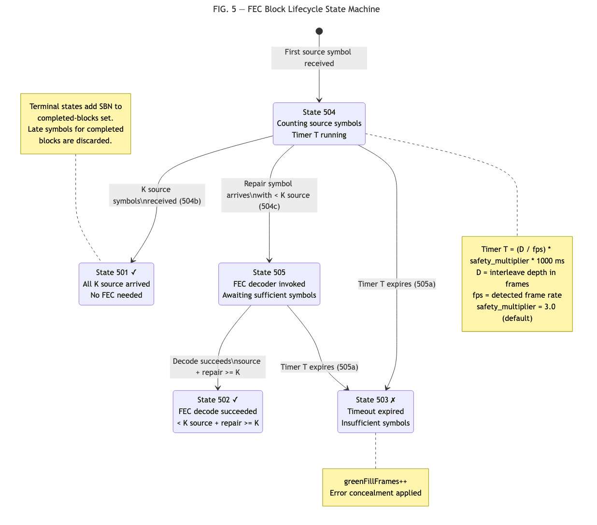

# PROVISIONAL PATENT APPLICATION

## FORWARD ERROR CORRECTION METHODS FOR PUBLISH/SUBSCRIBE MEDIA TRANSPORT WITH MULTI-PATH DELIVERY

### Inventor(s)
Omar Ramadan

### Assignee
Blockcast, Inc.

### Filing Date
To be assigned upon USPTO submission (package finalized July 2026)

---

## FIELD OF THE INVENTION

The present invention relates to forward error correction (FEC) in
media streaming systems, and more particularly to methods for
integrating application-layer FEC with publish/subscribe media
transport protocols across heterogeneous network paths including
reliable unicast, unreliable unicast, and multicast delivery.

---

## BACKGROUND OF THE INVENTION

### Media over QUIC Transport

Media over QUIC (MoQ) is an emerging IETF protocol for real-time media
delivery using a publish/subscribe model over QUIC and WebTransport.
In MoQ, media content is organized into broadcasts containing named
tracks, where each track carries a sequence of groups, and each group
contains a sequence of objects. A video track at 30 frames per second
produces approximately 30 groups per second, each containing one or
more objects representing coded video frames.

MoQ relays form a content distribution network where publishers send
media to relays, and subscribers receive media from relays. The pub/sub
model enables scalable delivery without requiring publishers to maintain
per-subscriber state.

### Forward Error Correction in Media Streaming

Forward Error Correction (FEC) enables receivers to recover lost
packets using redundant repair data without waiting for retransmissions.
RaptorQ (RFC 6330) and Reed-Solomon (RFC 5510) are widely used FEC
codes. In these codes, K source symbols are encoded to produce P
additional repair symbols. A receiver that obtains any K symbols from
the combined K+P set can recover the original source data.

FEC is organized into source blocks, each identified by a Source Block
Number (SBN). Within a block, each symbol has an Encoding Symbol ID
(ESI). Source symbols have ESI values 0 through K-1; repair symbols
have ESI values K through K+P-1.

### MMTP and Multicast Delivery

MPEG Media Transport Protocol (MMTP, ISO 23008-1) is used in ATSC 3.0
and ARIB STD-B60 broadcast television. MMTP packets carry a Source FEC
Payload ID (SS_ID) that identifies each source symbol with a flat
32-bit counter. The standard relationship is:

    SBN = floor(SS_ID / K)
    ESI = SS_ID mod K

MMTP packets are delivered via multicast UDP in broadcast systems.

### Limitations of Prior Art

Existing FEC systems have the following limitations:

1. **No transport mapping for pub/sub protocols.** RFC 6330 defines
   the FEC algorithm but leaves the mapping from transport-layer
   identifiers to FEC coordinates (SBN, ESI) to the Content Delivery
   Protocol. No standard defines this mapping for publish/subscribe
   protocols where media is identified by (track, group_id, object_id)
   rather than flat sequence numbers.

2. **Single-transport FEC.** Prior FEC systems assume symbols are
   received via a single transport protocol. RFC 6363 (FEC Framework)
   defines source and repair flows but does not address combining
   symbols from heterogeneous transports. 3GPP eMBMS and ATSC 3.0
   use unicast as a retry/repair channel (request-based), not as a
   real-time parallel delivery path whose symbols are combined with
   multicast symbols in the same FEC block.

3. **No receiver-side FEC-aware transport switching.** Existing
   multicast/unicast switching systems (e.g., US20060200576A1,
   US7788393B2) operate on buffer levels or duplicate frame detection,
   not on FEC block completeness or keyframe gating.

4. **Unspecified receiver block management.** RFC 6363 and RFC 6330
   deliberately leave receiver timeout and block lifecycle behavior
   unspecified. No standard defines codec-aware timeout computation
   or block state management that accounts for media frame rate and
   interleave depth.

---

## SUMMARY OF THE INVENTION

The present invention provides four interrelated methods for integrating
forward error correction with publish/subscribe media transport:

1. A deterministic formula for deriving FEC coordinates (SBN, ESI)
   from publish/subscribe transport identifiers (group_id, object_id),
   using time-based interleave depth expressed in milliseconds.

2. A method for combining FEC symbols received via heterogeneous
   transport protocols (e.g., reliable unicast streams, unreliable
   unicast datagrams, multicast UDP) into unified FEC blocks using shared coordinates.

3. A method for hybrid multicast/unicast source arbitration with
   FEC-aware keyframe gating and cross-transport repair symbol
   injection during transport transitions.

4. A FEC block lifecycle state machine with three-state accounting
   and codec-aware dynamic timeout computation.

---

## DETAILED DESCRIPTION OF THE INVENTION

### System Architecture

FIG. 1 illustrates the overall system architecture. A publisher (101)
encodes media and publishes it to a pub/sub relay (102) via a unicast
transport (e.g., QUIC, WebTransport, or other reliable protocol). The
relay distributes media to subscribers (103, 104) via unicast.
Optionally, the same media is simultaneously
transmitted via SSM multicast UDP (105) to multicast-capable
subscribers (103). A multicast-to-unicast gateway (106) may receive
multicast and re-publish to unicast subscribers.

Each media packet exists in two coordinate spaces:
- MoQ coordinates: (track_name, group_id, object_id)
- FEC coordinates: (SBN, ESI), equivalently SS_ID

The invention provides a deterministic mapping between these coordinate
spaces that produces identical FEC coordinates regardless of which
transport delivered the packet.

### First Embodiment: ESI Derivation Formula

FIG. 2 illustrates the ESI derivation process. Given a media object
received via the publish/subscribe transport with group identifier G
and object identifier O:

**Step 201:** The receiver obtains the interleave depth parameter from
the catalog or FEC configuration, expressed in milliseconds
(interleaveDepth_ms).

**Step 202:** The receiver computes the interleave depth in media
units (groups):

    D = ceil(interleaveDepth_ms / GOP_duration_ms)

where GOP_duration_ms is the duration of one media group (e.g.,
33.3ms for 30fps video, 21.3ms for 46.875fps audio). By expressing
interleave depth in milliseconds rather than frame counts, the same
catalog value produces appropriate FEC block sizes across media types
with different frame rates.

**Step 203:** The receiver derives the Source Block Number:

    SBN = floor(G / D)

**Step 204:** The receiver derives the Encoding Symbol ID:

    first_group = SBN * D
    symbols_per_group = ceil(K / D)
    ESI = (G - first_group) * symbols_per_group + O

where K is the number of source symbols per FEC block.

**Step 205:** The flat Source Symbol ID is recoverable as:

    SS_ID = SBN * K + ESI

This SS_ID is identical to the Source FEC Payload ID carried in MMTP
multicast packets per ISO 23008-1 Section C.5.2.

**Key Property:** A receiver that obtains the same media packet via
MoQ (using group_id, object_id) and via multicast UDP (using SS_ID
from the FEC Payload ID) derives identical (SBN, ESI) coordinates
using the respective derivation. This property enables multi-path FEC
combining (Second Embodiment).

**Example:** For a 30fps video stream with K=32, D=4 (interleaveDepth
= 133ms), a packet in Group 10, Object 3:

    SBN = floor(10 / 4) = 2
    first_group = 2 * 4 = 8
    symbols_per_group = ceil(32 / 4) = 8
    ESI = (10 - 8) * 8 + 3 = 19
    SS_ID = 2 * 32 + 19 = 83

A multicast receiver receiving the same packet reads SS_ID = 83 from
the FEC Payload ID, and computes:

    SBN = floor(83 / 32) = 2
    ESI = 83 mod 32 = 19

Both paths produce (SBN=2, ESI=19).

### Second Embodiment: Multi-Path FEC Symbol Combining

FIG. 3 illustrates the multi-path FEC combining process. A receiver
(301) has access to two or more transport paths delivering the same
media content:
- Path A: reliable unicast stream (e.g., QUIC, TCP, WebTransport)
- Path B: multicast UDP via SSM or AMT tunnel
- Path C (optional): unreliable unicast datagrams (e.g., QUIC datagrams)

**Step 302:** For each received symbol, the receiver derives FEC
coordinates (SBN, ESI) using the appropriate derivation:
- From MoQ: ESI derivation formula (First Embodiment)
- From multicast: SS_ID derivation (SBN = floor(SS_ID / K),
  ESI = SS_ID mod K)

**Step 303:** The receiver maintains a deduplication table keyed by
(SBN, ESI) within each track. If a symbol with the same coordinates
has already been received (from any path), the duplicate is discarded.

**Step 304:** Deduplicated symbols are inserted into a per-block FEC
decoder. The decoder does not distinguish symbols by transport origin;
it treats all symbols with valid (SBN, ESI) as equivalent inputs.

**Step 305:** When the decoder has received at least K symbols for a
block (from any combination of source and repair symbols, from any
combination of transport paths), it performs FEC decoding to recover
any missing source symbols.

**Advantages:**
- A receiver experiencing 10% multicast packet loss and receiving
  repair symbols via a reliable unicast path can achieve full recovery.
- Load balancing: the receiver can accept whichever symbols arrive
  first from any path.
- Graceful failover: if one transport path fails, symbols from the
  remaining path(s) continue to accumulate in the same FEC blocks.

### Third Embodiment: Hybrid Source Arbitration with FEC-Aware Switching

FIG. 4 illustrates the hybrid source arbitration state machine with
five states: UNICAST_ONLY (401), JOINING (402), MULTICAST_PRIMARY
(403), FAILING_BACK (404), and MULTICAST_STALLED (405).

**State 401 - UNICAST_ONLY:** The receiver is subscribed to a MoQ
track via a unicast transport. Media is received and rendered immediately.
The receiver initiates a multicast group join (IGMP/MLD) in parallel.
Transition to JOINING (402) upon join initiation.

**State 402 - JOINING:** The receiver continues rendering unicast
media. Multicast packets begin arriving but may not start at a
keyframe. The receiver buffers multicast packets but does NOT activate
multicast rendering.

**Step 402a - Keyframe Gate:** Upon receiving a video Random Access
Point (keyframe) via multicast, transition to MULTICAST_PRIMARY (403).
This ensures the video decoder can be initialized cleanly.

**Step 402b - Audio Independence:** Audio multicast activation is
gated on a separate timer. If audio arrives via multicast within a
configurable timeout (e.g., 2 seconds), audio switches to multicast
independently of video keyframe receipt.

**Step 402c - Cross-Transport Repair Injection:** During the JOINING
state, repair symbols received via the unicast transport are injected into FEC
blocks whose source symbols were received via multicast. This enables
FEC recovery during the transition period when multicast reception may
be lossy (e.g., due to IGMP convergence).

**State 403 - MULTICAST_PRIMARY:** Multicast is the primary media
source. Unicast frames for the same track are suppressed. The receiver
monitors multicast reception quality.

**Step 403a - Hysteresis:** The receiver does NOT switch away from
multicast on transient loss. A sustained loss threshold (e.g., N
consecutive FEC block failures) must be exceeded before transitioning
to FAILING_BACK (404).

**State 404 - FAILING_BACK:** The receiver re-subscribes to unicast
with a LatestGroup delivery preference to resynchronize to the current
media position. Once unicast data arrives, transition to
UNICAST_ONLY (401).

**State 405 - MULTICAST_STALLED:** If multicast reception degrades
but does not fully fail (e.g., high loss rate but some packets
arriving), the receiver may enter a stalled state where it continues
attempting multicast FEC recovery while preparing unicast fallback.

### Fourth Embodiment: FEC Block Lifecycle State Machine

FIG. 5 illustrates the per-block state machine with three terminal
states: CLEAN (501), RECOVERED (502), and FAILED (503), plus two
active states: ACCUMULATING (504) and DECODING (505).

**State 504 - ACCUMULATING:** Entered when the first source symbol
for a new block is received. A timeout timer T is started.

**Step 504a - Timeout Computation:**

    T = (D / fps) * safety_multiplier * 1000   [milliseconds]

where D is the interleave depth in frames, fps is the detected media
frame rate, and safety_multiplier is a configurable constant (default
3.0). This computation is performed once when the frame rate is first
detected from decoder output, and the result is applied to all
subsequent blocks.

**Step 504b - Source Symbol Counting:** Each received source symbol
increments a per-block counter. When the counter reaches K, the block
transitions to CLEAN (501) — all source symbols arrived, no FEC
decoding is necessary.

**Step 504c - Repair Symbol Receipt:** When a repair symbol arrives
for a block in ACCUMULATING state with fewer than K source symbols,
the block transitions to DECODING (505).

**State 505 - DECODING:** The FEC decoder is invoked with all
available symbols (source + repair). If the decoder succeeds
(total symbols >= K), transition to RECOVERED (502). If the decoder
does not yet have sufficient symbols, remain in DECODING.

**Step 505a - Timeout Expiry:** If timer T expires in either
ACCUMULATING or DECODING state, the block transitions to FAILED (503).
A green-fill frame or error concealment is applied.

**Terminal States:**

**State 501 - CLEAN:** All K source symbols received. No FEC overhead
incurred. Block statistics counter `blocksClean` is incremented.

**State 502 - RECOVERED:** FEC decoding succeeded with fewer than K
source symbols. Counter `blocksRecovered` is incremented.

**State 503 - FAILED:** Timeout expired with insufficient symbols.
Counter `blocksFailed` is incremented. Counter `greenFillFrames` is
incremented.

**Completed-Block Guard:** Upon entering any terminal state (CLEAN,
RECOVERED, or FAILED), the block's SBN is added to a bounded
completed-blocks set. Subsequent symbols arriving for a completed
block are discarded without restarting timers or re-entering the
state machine. The completed-blocks set uses insertion-order eviction,
retaining the most recent N entries (e.g., N=500) to prevent unbounded
memory growth.

**Per-Track Decoder Routing:** The state machine is instantiated per
media track, keyed by track identifier (e.g., MMTP packet_id). Each
track has independent K, timeout parameters, and block state. This
enables different FEC configurations per media type: video may use
K=32 with 133ms interleave while audio uses K=4 with 40ms interleave.

---

## CLAIMS

### Independent Claim 1

A method for forward error correction in a publish/subscribe media
transport system, comprising:

(a) receiving a media object identified by a group identifier G and an
    object identifier O within a named track of a publish/subscribe
    media session;

(b) obtaining a time-based interleave depth parameter expressed in
    milliseconds from a catalog document or control message;

(c) computing an interleave depth D in media units from said
    millisecond parameter and a media frame duration;

(d) deriving a Source Block Number SBN equal to the floor of G divided
    by D;

(e) deriving an Encoding Symbol ID ESI equal to the quantity
    (G minus the product of SBN and D) multiplied by the ceiling of
    K divided by D, plus O, where K is the number of source symbols
    per FEC block;

(f) using said SBN and ESI to identify the position of said media
    object within a FEC block for encoding or decoding;

wherein a flat Source Symbol ID SS_ID equal to the product of SBN and
K plus ESI is derivable from said SBN and ESI, and said SS_ID is
identical to a Source FEC Payload ID carried in multicast transport
packets for the same media content, enabling a receiver to assign
symbols received via the publish/subscribe transport and symbols
received via multicast transport to the same FEC block.

### Dependent Claim 2

The method of Claim 1, wherein the interleave depth parameter is
expressed in milliseconds in the catalog document, and the receiver
converts to media units using a detected frame duration, making the
FEC block mapping independent of the media frame rate.

### Dependent Claim 3

The method of Claim 1, wherein a relay node performs said derivation
to translate between a multicast transport carrying said SS_ID and a
publish/subscribe transport carrying said group identifier and object
identifier, bridging FEC coordinates between transport domains without
modifying the underlying FEC block structure.

### Dependent Claim 4

The method of Claim 1, wherein the same derivation is performed
independently at multiple receivers, each producing identical SBN and
ESI values for the same media object regardless of which transport
path delivered it.

### Independent Claim 5

A method for recovering media data in a streaming system, comprising:

(a) receiving one or more source symbols via a first transport
    protocol;

(b) receiving one or more repair symbols via a second transport
    protocol different from said first transport protocol;

(c) for each received symbol, deriving FEC coordinates comprising a
    Source Block Number and an Encoding Symbol ID, wherein said
    coordinates are identical for the same media content regardless
    of which transport protocol delivered the symbol;

(d) deduplicating symbols received via multiple transport paths using
    said FEC coordinates as a uniqueness key;

(e) inserting deduplicated source and repair symbols from said
    different transport protocols into a single FEC decoder instance
    for the corresponding source block;

(f) performing FEC decoding on said combined symbols when the total
    count of received symbols meets or exceeds K, recovering any
    missing source symbols.

### Dependent Claim 6

The method of Claim 5, wherein source symbols are received via
multicast UDP and repair symbols are received via a reliable unicast
transport (e.g., QUIC or TCP), enabling FEC recovery where the
unreliable multicast path provides bulk source data and the reliable
unicast path provides targeted repair.

### Dependent Claim 7

The method of Claim 5, wherein a receiver dynamically switches its
primary source from one transport protocol to another while
maintaining FEC block continuity, such that symbols received before
and after the switch contribute to the same FEC block.

### Dependent Claim 8

The method of Claim 5, wherein deriving FEC coordinates for symbols
received via the publish/subscribe transport uses the method of
Claim 1.

### Independent Claim 9

A method for media reception in a hybrid delivery system, comprising:

(a) subscribing to a media track via a unicast publish/subscribe
    transport;

(b) simultaneously initiating a multicast group join for the same
    media content;

(c) receiving and rendering media from the unicast transport during
    a multicast join period;

(d) upon receiving a random access point via the multicast transport,
    activating multicast as a primary media source and suppressing
    duplicate frames from the unicast transport;

(e) during a transition period between unicast and multicast primary
    sources, injecting FEC repair symbols received from the unicast
    transport into FEC blocks whose source symbols were received from
    the multicast transport;

(f) applying hysteresis to a transport switching decision, requiring
    sustained loss exceeding a threshold before switching away from
    multicast;

(g) upon detecting sustained multicast failure, re-subscribing to
    unicast with a delivery preference that resynchronizes to a
    current media position.

### Dependent Claim 10

The method of Claim 9, wherein audio multicast activation is gated on
a timer independent of video random access point receipt, enabling
audio to activate via multicast before video has received a keyframe.

### Dependent Claim 11

The method of Claim 9, wherein said FEC repair symbol injection uses
FEC coordinates derived according to the method of Claim 1, ensuring
symbols from both transport paths are correctly assigned to the same
FEC block.

### Dependent Claim 12

The method of Claim 9, wherein a FEC block lifecycle state machine
tracks block completeness across both transport paths, and determines
when to attempt FEC recovery based on combined symbol counts from
both transports.

### Independent Claim 13

A method for managing forward error correction decoding in a media
receiver, comprising:

(a) maintaining a per-block state with three mutually exclusive
    terminal outcomes: clean, indicating all K source symbols were
    received; recovered, indicating FEC decoding with repair symbols
    succeeded; and failed, indicating a timeout expired with
    insufficient symbols;

(b) starting a block timeout upon receipt of a first source symbol
    for a block;

(c) computing said timeout as a function of an interleave depth in
    frames, a detected media frame rate, and a safety multiplier;

(d) transitioning a block to the clean state when K source symbols
    are received before said timeout;

(e) attempting FEC decoding when repair symbols are received for a
    block with fewer than K source symbols;

(f) transitioning a block to the failed state when said timeout
    expires with fewer than K total symbols;

(g) maintaining a completed-blocks set and discarding symbols that
    arrive for blocks already in a terminal state, preventing
    late-arriving symbols from restarting timeouts or triggering
    redundant decoding.

### Dependent Claim 14

The method of Claim 13, further comprising refining the timeout
computation when the frame rate is first detected from decoder output,
and propagating said refined timeout to active decoder instances.

### Dependent Claim 15

The method of Claim 13, further comprising maintaining per-track FEC
decoder instances keyed by media track identifier, each with
independent K value, timeout parameter, and block state, enabling
different FEC configurations per media type within the same session.

### Dependent Claim 16

The method of Claim 13, further comprising exposing counters for
blocks in each terminal state as real-time statistics for adaptive
quality monitoring.

### Dependent Claim 17

The method of Claim 13, wherein the completed-blocks set is bounded
using insertion-order eviction, retaining a most recent N entries.

---

## ABSTRACT

A method for integrating forward error correction (FEC) with
publish/subscribe media transport protocols. A deterministic formula
maps publish/subscribe transport identifiers (group_id, object_id) to
FEC encoding coordinates (Source Block Number, Encoding Symbol ID)
using time-based interleave depth, producing coordinates identical to
those carried in multicast transport packets for the same content.
This enables real-time combining of FEC symbols received via
heterogeneous transport protocols — including reliable unicast streams,
unreliable unicast datagrams, and multicast UDP — into unified FEC blocks.
A hybrid source arbitration method switches between multicast and
unicast delivery with FEC-aware keyframe gating and cross-transport
repair symbol injection. A block lifecycle state machine with three
terminal states (clean, recovered, failed) and codec-aware dynamic
timeout manages FEC decoding with per-track routing.

---

## FIGURES

**FIG. 1:** System architecture showing publisher, MoQ relay, unicast
subscribers, multicast path, and multicast-to-unicast gateway with
dual coordinate spaces (MoQ and FEC).

**FIG. 2:** ESI derivation flowchart: input (G, O, interleaveDepth_ms,
K, GOP_duration_ms) through computation steps producing (SBN, ESI,
SS_ID).

**FIG. 3:** Multi-path FEC combining: two transport paths delivering
symbols to a shared deduplication table and FEC decoder, with
coordinate derivation per path.

**FIG. 4:** Hybrid source arbitration state machine with five states
(UNICAST_ONLY, JOINING, MULTICAST_PRIMARY, FAILING_BACK,
MULTICAST_STALLED) and transition conditions.

**FIG. 5:** FEC block lifecycle state machine with states
(ACCUMULATING, DECODING) and terminal states (CLEAN, RECOVERED,
FAILED), showing timeout computation and completed-block guard.

