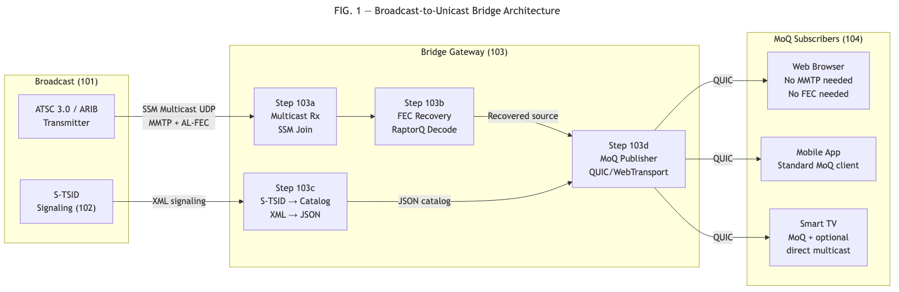
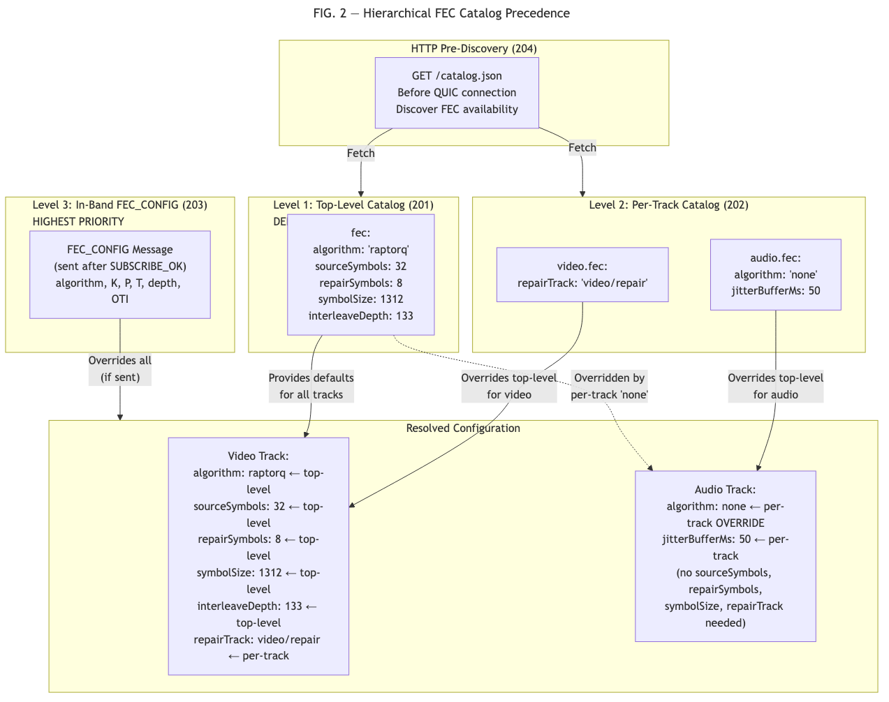
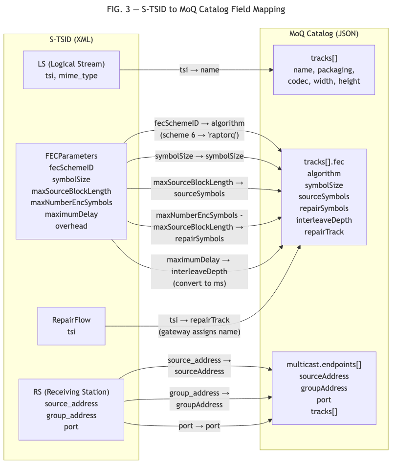
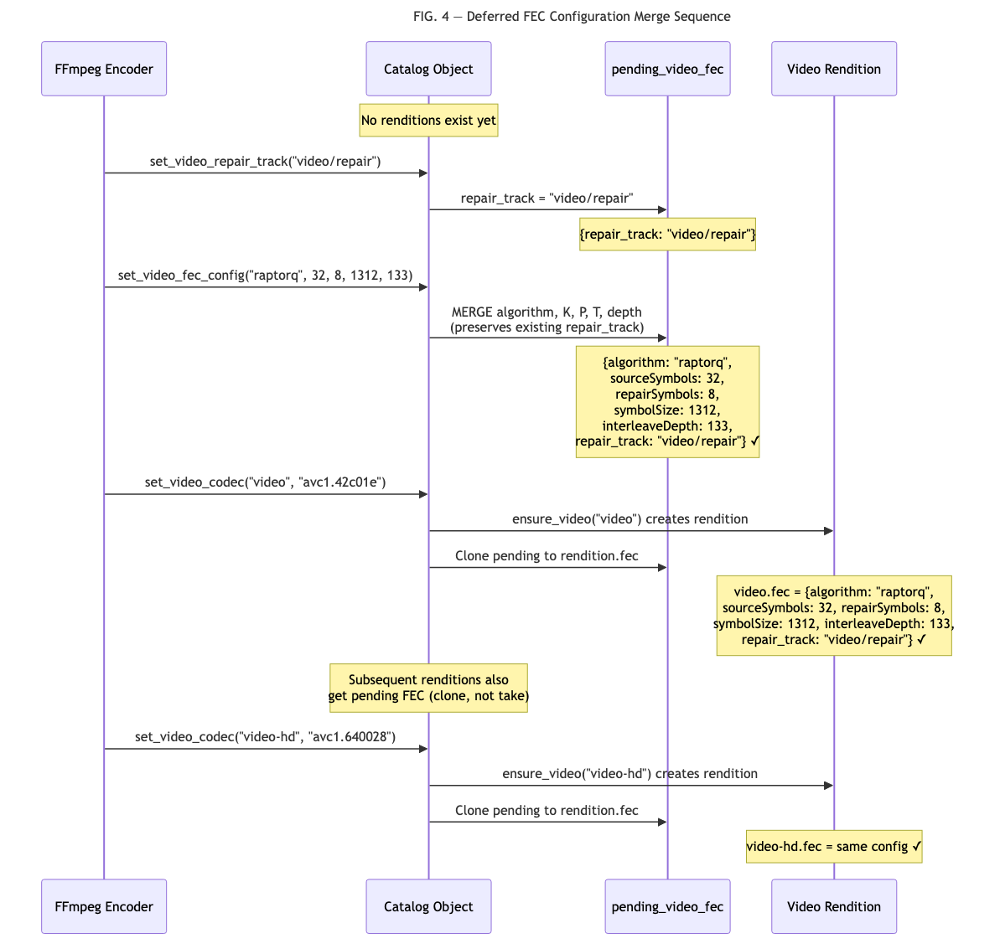

# PROVISIONAL PATENT APPLICATION

## BROADCAST-TO-UNICAST MEDIA BRIDGE WITH FEC PRESERVATION AND HIERARCHICAL FEC CATALOG SIGNALING

### Inventor(s)
Omar Ramadan

### Assignee
Blockcast, Inc.

### Filing Date
To be assigned upon USPTO submission (package finalized July 2026)

---

## FIELD OF THE INVENTION

The present invention relates to media delivery systems that bridge
broadcast television infrastructure to unicast streaming protocols,
and to methods for signaling forward error correction parameters in
media streaming catalogs with hierarchical configuration.

---

## BACKGROUND OF THE INVENTION

### Broadcast Television and MMTP

ATSC 3.0 (Advanced Television Systems Committee) is the next-generation
broadcast television standard used in the Americas and South Korea.
ARIB STD-B60 is the equivalent standard used in Japan. Both standards
use MPEG Media Transport Protocol (MMTP, ISO 23008-1) for media
delivery over broadcast networks.

Broadcast media is transmitted via Source-Specific Multicast (SSM)
using MMTP packets that carry application-layer FEC metadata, including
Source FEC Payload IDs for source symbols and Repair FEC Payload IDs
for repair symbols. FEC parameters are signaled via the S-TSID
(Service-based Transport Session Instance Description), an XML document
containing FECParameters elements with RaptorQ OTI (Object Transmission
Information), symbol sizes, and block configurations.

### Media over QUIC (MoQ)

Media over QUIC (MoQ) is an emerging IETF protocol for real-time media
delivery using a publish/subscribe model over QUIC and WebTransport.
MoQ uses JSON-based catalogs to describe available media tracks,
codecs, and configurations. Subscribers fetch catalogs to discover
available content before establishing subscriptions.

### FEC Signaling in Prior Art

Existing FEC signaling methods include:

- **SDP (RFC 6364):** Session Description Protocol attributes for FEC
  Framework configuration. Requires SIP or RTSP session establishment.
  Per-flow configuration without hierarchical defaults.

- **ATSC S-TSID (A/331):** XML-based signaling with per-RepairFlow
  FEC parameters. Not hierarchical. Not accessible via HTTP.

- **DASH MPD:** Has hierarchical structure (Period, AdaptationSet,
  Representation) with property inheritance, but defines NO FEC-specific
  properties.

- **MoQ Catalog (I-D.ietf-moq-catalogformat):** JSON-based catalog
  for MoQ track discovery. Contains ZERO provisions for FEC parameter
  signaling.

### Limitations of Prior Art

1. **No broadcast-to-MoQ bridge exists.** ATSC 3.0 gateways (e.g.,
   ADTH, HDHomeRun) convert broadcast to local network streaming
   but do not output MoQ tracks, do not preserve FEC parameters,
   and do not convert S-TSID to MoQ catalog format.

2. **No S-TSID to MoQ catalog conversion.** S-TSID (XML) and MoQ
   catalog (JSON) are structurally different. No standard or known
   system defines a bidirectional conversion between them.

3. **No hierarchical FEC catalog.** FEC parameters in streaming
   manifests are either session-level (SDP), per-flow (S-TSID),
   or absent (DASH, MoQ). No system provides top-level FEC defaults
   with per-track overrides in a hierarchically structured catalog.

4. **No pre-subscription FEC discovery.** In SDP-based systems,
   FEC parameters are exchanged during session negotiation. Subscribers
   cannot discover FEC availability before committing to a session.

---

## SUMMARY OF THE INVENTION

The present invention provides two interrelated systems:

1. An end-to-end broadcast-to-unicast bridge that receives broadcast
   media via SSM multicast, performs FEC recovery, converts broadcast
   signaling (S-TSID) to streaming catalog (MoQ JSON), and
   re-publishes media as MoQ tracks — enabling subscribers without
   broadcast receiver hardware, MMTP decoders, or FEC processing
   capability to consume broadcast content.

2. A hierarchical FEC catalog signaling method where FEC parameters
   are specified at top-level (defaults) and per-track (overrides)
   in a JSON catalog, discoverable via HTTP before subscription, with
   in-band control message override and support for per-track algorithm
   selection including a "none" mode with jitter buffering.

---

## DETAILED DESCRIPTION OF THE INVENTION

### First Embodiment: Broadcast-to-Unicast Bridge

FIG. 1 illustrates the broadcast-to-unicast bridge architecture.

**Component 101 - Broadcast Transmitter:** An ATSC 3.0 or ARIB STD-B60
broadcast transmitter emitting MMTP packets via SSM multicast. The
transmitter generates AL-FEC repair symbols using RaptorQ (RFC 6330)
and transmits both source and repair MMTP packets on the multicast
group.

**Component 102 - S-TSID Signaling:** The broadcast system distributes
S-TSID signaling containing:
- Logical Stream (LS) elements describing media tracks
- FECParameters elements with: fecSchemeID, symbolSize,
  maxSourceBlockLength (K), maxNumberEncSymbols (K+P)
- RepairFlow elements mapping repair data to source streams
- RS (Receiving Station) elements with multicast group addresses

**Component 103 - Bridge Gateway:** The bridge gateway performs:

**Step 103a - Multicast Reception:** The gateway joins the SSM
multicast group and receives MMTP packets (both source and repair).

**Step 103b - FEC Recovery:** The gateway performs RaptorQ or
Reed-Solomon FEC decoding on received blocks. For blocks where all
K source symbols arrived cleanly, no decoding is necessary. For blocks
with missing source symbols, the gateway uses available repair symbols
to recover the missing data.

**Step 103c - S-TSID to Catalog Conversion:** The gateway converts
broadcast signaling to a MoQ JSON catalog using the following field
mapping:

| S-TSID Field | MoQ Catalog Field |
|---|---|
| LS (Logical Stream) | `tracks[]` entry |
| LS.tsi (Transport Session ID) | `tracks[].name` |
| FECParameters.fecSchemeID | `tracks[].fec.algorithm` (scheme 6 -> "raptorq") |
| FECParameters.symbolSize | `tracks[].fec.symbolSize` |
| FECParameters.maxSourceBlockLength | `tracks[].fec.sourceSymbols` |
| FECParameters.maxNumberEncSymbols - maxSourceBlockLength | `tracks[].fec.repairSymbols` |
| RepairFlow.tsi | `tracks[].fec.repairTrack` (gateway assigns track name) |
| FECParameters.maximumDelay | `tracks[].fec.interleaveDepthMs` (converted to ms) |
| RS.source_address | `multicast.endpoints[].sourceAddress` |
| RS.group_address | `multicast.endpoints[].groupAddress` |
| RS.port | `multicast.endpoints[].port` |

The reverse conversion (MoQ catalog to S-TSID) uses the inverse
mapping, enabling MoQ-originated content to be retransmitted via
broadcast infrastructure.

**Step 103d - MoQ Publication:** The gateway publishes FEC-recovered
source media as MoQ tracks over QUIC/WebTransport. Each MMTP source
track becomes a MoQ track. The gateway may optionally:
- Re-publish both source and repair tracks (for subscribers wanting
  FEC protection on the unicast path)
- Re-package MMTP media into CMAF (fMP4) segments for compatibility
  with HLS/DASH clients
- Strip MMTP headers and deliver raw codec bitstream

**Component 104 - MoQ Subscribers:** Subscribers receive media via
standard MoQ subscription without requiring MMTP decoders, FEC
processing, or broadcast receiver hardware. They interact with the
bridge gateway as they would with any MoQ publisher.

**Step 103e - Bidirectional Operation:** The reverse path enables MoQ
publishers to reach broadcast infrastructure:
1. MoQ subscriber sends media to the bridge gateway
2. Gateway converts MoQ catalog to S-TSID
3. Gateway packages media as MMTP packets with AL-FEC
4. Gateway transmits via SSM multicast

### Second Embodiment: Hierarchical FEC Catalog Signaling

FIG. 2 illustrates the hierarchical FEC catalog structure and
precedence model.

**Level 1 - Top-Level Defaults (201):** The catalog JSON document
contains a top-level `fec` object specifying default FEC parameters:

```json
{
  "fec": {
    "algorithm": "raptorq",
    "sourceSymbols": 32,
    "repairSymbols": 8,
    "symbolSize": 1312,
    "interleaveDepthMs": 133
  },
  "tracks": [ ... ]
}
```

These defaults apply to all tracks that do not specify their own FEC
configuration.

**Level 2 - Per-Track Overrides (202):** Individual tracks may override
specific fields from the top-level defaults:

```json
{
  "tracks": [
    {
      "name": "video",
      "fec": {
        "repairTrack": "video/repair"
      }
    },
    {
      "name": "audio",
      "fec": {
        "algorithm": "none",
        "jitterBufferMs": 50
      }
    }
  ]
}
```

The video track inherits all top-level FEC parameters and adds its
repair track name. The audio track overrides the algorithm to "none"
with a jitter buffer, indicating no FEC encoding is applied and the
receiver should use a 50ms reorder buffer.

**Level 3 - In-Band Override (203):** After subscription establishment,
an in-band FEC_CONFIG control message may be sent from publisher to
subscriber. This message carries authoritative FEC parameters that
override both per-track and top-level catalog values.

**Precedence Order:**
    FEC_CONFIG message > per-track catalog > top-level catalog defaults

**Step 204 - HTTP Pre-Discovery:** The catalog is fetchable via HTTP
(e.g., GET /catalog.json) before establishing a MoQ session. This
enables subscribers to:
- Discover whether FEC is available for a track
- Determine the FEC algorithm and parameters
- Decide whether to subscribe to repair tracks
- Estimate bandwidth overhead (repairSymbols / sourceSymbols)

All before committing to a QUIC connection or subscription.

**Step 205 - "None" Algorithm:** The algorithm value "none" (registry
value 0x00) indicates no FEC encoding. When present, source data is
delivered without repair symbols. The optional `jitterBufferMs` field
specifies a receiver-side reorder buffer in milliseconds, providing
tolerance for out-of-order packet delivery without FEC overhead.

Use cases for "none":
- Audio tracks where codec-level Packet Loss Concealment (PLC)
  adequately handles gaps
- Ultra-low-latency (ULL) applications where any FEC latency is
  unacceptable (e.g., financial data feeds)
- Reliable QUIC stream delivery where retransmission is sufficient

**Step 206 - Per-Track Algorithm Selection:** Different media types
within the same session can use different FEC algorithms:

| Media Type | Recommended Algorithm | Rationale |
|---|---|---|
| Video | raptorq | Large keyframes expensive to lose |
| Audio | none | Small frames, PLC handles gaps |
| Subtitles | none | Reliable QUIC sufficient |

This minimizes total FEC overhead by applying protection only where
recovery provides significant benefit.

**Step 207 - Deferred Configuration Merging:** In implementation, FEC
parameters may be set before track renditions exist in the catalog
(e.g., when the encoder signals FEC configuration before the first
media frame). The system maintains a pending FEC configuration that is
merged incrementally:
1. `set_repair_track("video/repair")` sets repair_track in pending
2. `set_fec_config("raptorq", 32, 8, 1312, 133)` merges algorithm,
   K, P, T, depth into pending WITHOUT overwriting repair_track
3. When a track rendition is created, the pending configuration is
   cloned to the rendition

This ordering-independent merge ensures that parameters set by
different system components at different times are correctly combined.

---

## CLAIMS

### Independent Claim 1

A system for bridging broadcast media to unicast streaming, comprising:

(a) a broadcast gateway receiving media packets with application-layer
    forward error correction via source-specific multicast from a
    broadcast transmitter;

(b) said gateway performing FEC decoding on received packets to
    recover media lost during broadcast transmission;

(c) said gateway converting broadcast signaling from a first format
    to a streaming catalog in a second format, wherein said conversion
    maps:
    - stream elements to catalog track entries;
    - FEC parameters to catalog FEC extension fields, including mapping
      a scheme identifier to an algorithm string, a symbol size to a
      symbolSize integer, a source block length to a sourceSymbols
      integer, and a difference between total encoding symbols and
      source block length to a repairSymbols integer;
    - repair flow elements to catalog repair track entries;

(d) said gateway publishing recovered source media as tracks in a
    publish/subscribe session over a reliable transport protocol;

(e) one or more subscribers receiving said tracks without requiring
    capability to decode said media packets in their original format,
    without requiring FEC processing, and without requiring broadcast
    receiver hardware.

### Dependent Claim 2

The system of Claim 1, wherein said first format is S-TSID XML
conforming to ATSC A/331 and said second format is JSON conforming to
a MoQ catalog format.

### Dependent Claim 3

The system of Claim 1, further comprising the reverse conversion from
said second format to said first format, enabling content originated
in the publish/subscribe system to be retransmitted via broadcast
infrastructure.

### Dependent Claim 4

The system of Claim 1, wherein said gateway re-packages recovered
media from a first container format to a second container format,
producing segments compatible with HTTP adaptive streaming protocols.

### Dependent Claim 5

The system of Claim 1, wherein said gateway selectively publishes
both source and repair tracks for subscribers that request FEC
protection, while publishing source-only tracks for subscribers
that do not.

### Dependent Claim 6

The system of Claim 1, wherein said gateway is deployed at an ISP
edge router with inline multicast tunneling capability, forming a
hierarchical distribution node that receives broadcast via tunnel
and re-publishes to local subscribers.

### Independent Claim 7

A method for forward error correction parameter signaling in a media
streaming system, comprising:

(a) providing a catalog document containing:
    - a top-level FEC configuration object specifying default
      parameters including an algorithm identifier, a source symbol
      count, a repair symbol count, a symbol size, and an interleave
      depth;
    - one or more per-track FEC configuration objects, each capable of
      overriding specific fields from said top-level defaults, wherein
      fields not specified in a per-track object inherit values from
      said top-level object;

(b) making said catalog document available via HTTP prior to
    establishment of a streaming session, enabling subscribers to
    discover FEC parameters before subscription;

(c) after subscription establishment, optionally sending an in-band
    control message carrying authoritative FEC parameters;

(d) applying a precedence order wherein said in-band control message
    overrides per-track catalog values, which override top-level
    catalog defaults.

### Dependent Claim 8

The method of Claim 7, wherein said algorithm identifier includes a
"none" value indicating no FEC encoding, and said per-track FEC
configuration object for a track with algorithm "none" includes a
jitterBufferMs field specifying a receiver-side reorder buffer in
milliseconds.

### Dependent Claim 9

The method of Claim 7, wherein different tracks within the same
catalog specify different algorithm identifiers, enabling per-media-type
FEC selection within a single streaming session.

### Dependent Claim 10

The method of Claim 7, further comprising maintaining a deferred FEC
configuration that is merged incrementally as track renditions are
created, wherein parameters set by separate configuration operations
at different times are combined without overwriting previously set
fields.

### Dependent Claim 11

The method of Claim 7, wherein said interleave depth is expressed in
milliseconds, decoupling the FEC block span from media frame rate and
enabling the same catalog value to apply to media types with different
frame rates.

### Dependent Claim 12

The method of Claim 7, wherein for multicast delivery where no
back-channel exists for said in-band control message, said catalog
FEC parameters serve as the sole authoritative configuration source.

---

## ABSTRACT

A system and method for bridging broadcast television (ATSC 3.0,
ARIB STD-B60) to unicast streaming (MoQ/WebTransport) with forward
error correction preservation. A gateway receives MMTP broadcast
media via SSM multicast, performs FEC recovery, converts broadcast
signaling (S-TSID XML) to a streaming catalog (MoQ JSON) with
algorithmic field mapping, and re-publishes recovered media as
publish/subscribe tracks. Subscribers consume content without
requiring broadcast hardware, MMTP decoders, or FEC capability.
A hierarchical FEC catalog signaling method provides top-level
defaults with per-track overrides in a JSON catalog, HTTP-accessible
before subscription, with in-band control message override. Per-track
algorithm selection supports mixed FEC schemes (e.g., video=raptorq,
audio=none) and a "none" mode with receiver-side jitter buffering.

---

## FIGURES

**FIG. 1:** Broadcast-to-unicast bridge architecture showing broadcast
transmitter, SSM multicast path, bridge gateway (with FEC recovery,
S-TSID conversion, MoQ publication), and MoQ subscribers.



**FIG. 2:** Hierarchical FEC catalog structure showing three
precedence levels (top-level defaults, per-track overrides, in-band
FEC_CONFIG message) with inheritance arrows and override semantics.



**FIG. 3:** S-TSID to MoQ catalog conversion field mapping diagram
showing XML elements mapped to JSON fields.



**FIG. 4:** Deferred FEC configuration merge sequence showing three
configuration calls and their cumulative effect on pending and
rendition FEC state.


